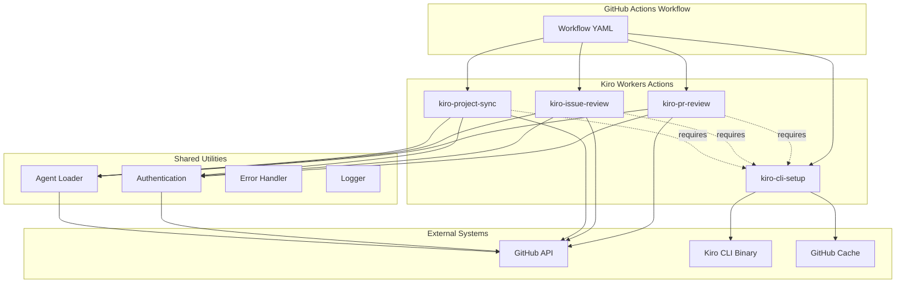

# Design Document: Kiro Workers

## Overview

The Kiro Workers project implements four discrete GitHub Actions that integrate Kiro CLI capabilities into GitHub workflows. This design follows a modular architecture where each action is independently deployable and configurable, with shared utilities for common functionality.

**Key Design Principles:**
- **Zero third-party dependencies**: Only use @actions/* packages and Node.js built-ins for security
- **Agent hierarchy**: Support default agents, custom agents, and workflow-level overrides
- **Fail-fast with clear errors**: Provide actionable error messages for troubleshooting
- **Minimal permissions**: Each action requests only the permissions it needs
- **Caching for performance**: Cache Kiro CLI binaries to reduce download time

**Technology Stack:**
- **Runtime**: Node.js (GitHub Actions native runtime)
- **Language**: TypeScript (compiled to JavaScript for distribution)
- **GitHub Actions SDK**: @actions/core, @actions/github, @actions/tool-cache, @actions/exec, @actions/http-client
- **Distribution**: Bundled JavaScript (using ncc or similar) with no external dependencies

## Architecture

### High-Level Architecture



### Action Dependencies

1. **kiro-cli-setup** (no dependencies)
   - Downloads and caches Kiro CLI binary
   - Makes CLI available in PATH for subsequent steps

2. **kiro-pr-review** (depends on setup)
   - Requires Kiro CLI in PATH
   - Analyzes pull requests and posts comments

3. **kiro-issue-review** (depends on setup)
   - Requires Kiro CLI in PATH
   - Analyzes issues and posts comments

4. **kiro-project-sync** (depends on setup)
   - Requires Kiro CLI in PATH
   - Syncs spec tasks to GitHub Projects

## Components and Interfaces

### 1. Kiro CLI Setup Action

**Purpose**: Download, verify, cache, and install the Kiro CLI binary.

**Inputs:**
```typescript
interface SetupInputs {
  version?: string;  // Kiro CLI version (default: "latest")
  token?: string;    // GitHub token for API access (default: GITHUB_TOKEN)
}
```

**Outputs:**
```typescript
interface SetupOutputs {
  version: string;        // Resolved version number
  cacheHit: boolean;      // Whether binary was loaded from cache
  installPath: string;    // Path where CLI was installed
}
```

**Core Functions:**
```typescript
// Resolve version (convert "latest" to specific version)
async function resolveVersion(version: string, token: string): Promise<string>

// Download binary for current platform
async function downloadBinary(version: string, platform: string, arch: string): Promise<string>

// Verify binary integrity using checksums
async function verifyBinary(binaryPath: string, expectedChecksum: string): Promise<boolean>

// Cache binary for future runs
async function cacheBinary(binaryPath: string, version: string): Promise<void>

// Restore binary from cache
async function restoreBinary(version: string): Promise<string | null>

// Add binary to PATH
async function addToPath(binaryPath: string): Promise<void>
```

**Implementation Notes:**
- Use @actions/tool-cache for caching (built-in GitHub Actions caching)
- Use @actions/http-client for downloading binaries
- Cache key format: `kiro-cli-${platform}-${arch}-${version}`
- Always resolve "latest" to a specific version before caching
- Support Linux, macOS, and Windows runners

### 2. Pull Request Review Action

**Purpose**: Analyze pull requests using Kiro CLI and post review comments.

**Inputs:**
```typescript
interface PRReviewInputs {
  token: string;              // GitHub token (required)
  workflowPrompt?: string;    // Override prompt from workflow
  filePatterns?: string[];    // File patterns to analyze
  skipIfDraft?: boolean;      // Skip draft PRs (default: false)
}
```

**Agent Configuration:**
```typescript
interface PRAgentConfig {
  prompt: string;             // Agent prompt
  systemPrompt?: string;      // System-level instructions
  filePatterns?: string[];    // Files to include in analysis
  excludePatterns?: string[]; // Files to exclude
  maxFilesSize?: number;      // Max total file size to analyze
}
```

**Core Functions:**
```typescript
// Load agent configuration (custom or default)
async function loadPRAgent(workflowPrompt?: string): Promise<PRAgentConfig>

// Get PR context from GitHub API
async function getPRContext(prNumber: number): Promise<PRContext>

// Get linked issues from PR description
async function getLinkedIssues(prBody: string): Promise<Issue[]>

// Check if PR changes relate to specs
async function getRelatedSpecs(changedFiles: string[]): Promise<SpecFile[]>

// Invoke Kiro CLI with context
async function analyzeWithKiro(context: PRContext, agent: PRAgentConfig): Promise<string>

// Post review comment
async function postReviewComment(prNumber: number, comment: string): Promise<void>
```

**Data Structures:**
```typescript
interface PRContext {
  number: number;
  title: string;
  body: string;
  author: string;
  changedFiles: FileChange[];
  linkedIssues: Issue[];
  relatedSpecs: SpecFile[];
}

interface FileChange {
  path: string;
  status: 'added' | 'modified' | 'deleted' | 'renamed';
  additions: number;
  deletions: number;
  patch: string;
}
```

**Default Agent Behavior:**
- Check if changed files relate to `.kiro/specs/` directory
- If specs exist, validate changes against spec requirements and design
- Check if PR description references issues (e.g., "Fixes #123", "Closes #456")
- If issues are linked, verify that PR changes address the issue

### 3. Issue Review Action

**Purpose**: Analyze GitHub issues using Kiro CLI and post analysis comments.

**Inputs:**
```typescript
interface IssueReviewInputs {
  token: string;              // GitHub token (required)
  workflowPrompt?: string;    // Override prompt from workflow
  checkDuplicates?: boolean;  // Check for duplicate issues (default: true)
  checkScope?: boolean;       // Check against specs (default: true)
}
```

**Agent Configuration:**
```typescript
interface IssueAgentConfig {
  prompt: string;             // Agent prompt
  systemPrompt?: string;      // System-level instructions
  checkDuplicates: boolean;   // Whether to check for duplicates
  checkScope: boolean;        // Whether to validate against specs
  similarityThreshold?: number; // Threshold for duplicate detection
}
```

**Core Functions:**
```typescript
// Load agent configuration (custom or default)
async function loadIssueAgent(workflowPrompt?: string): Promise<IssueAgentConfig>

// Get issue context from GitHub API
async function getIssueContext(issueNumber: number): Promise<IssueContext>

// Get all existing issues for duplicate detection
async function getAllIssues(): Promise<Issue[]>

// Get specs for scope validation
async function getSpecs(): Promise<SpecFile[]>

// Invoke Kiro CLI with context
async function analyzeWithKiro(context: IssueContext, agent: IssueAgentConfig): Promise<string>

// Post analysis comment
async function postIssueComment(issueNumber: number, comment: string): Promise<void>
```

**Data Structures:**
```typescript
interface IssueContext {
  number: number;
  title: string;
  body: string;
  author: string;
  labels: string[];
  existingIssues: Issue[];
  specs: SpecFile[];
}

interface Issue {
  number: number;
  title: string;
  body: string;
  state: 'open' | 'closed';
  labels: string[];
}
```

**Default Agent Behavior:**
- Check if `.kiro/specs/` exists in repository
- If specs exist, validate that issue is within scope of current requirements
- Retrieve all existing issues (open and closed)
- Check for potential duplicates using semantic similarity
- If duplicates found, include links in comment

### 4. Project Sync Action

**Purpose**: Synchronize Kiro spec tasks to GitHub Projects.

**Inputs:**
```typescript
interface ProjectSyncInputs {
  token: string;                    // GitHub token (required)
  projectId: string;                // GitHub Project ID
  syncMode?: 'one-way' | 'two-way'; // Sync direction (default: 'one-way')
  crossRepo?: boolean;              // Enable cross-repo sync (default: false)
  workflowConfig?: string;          // Override config from workflow
}
```

**Agent Configuration:**
```typescript
interface ProjectAgentConfig {
  projectId: string;
  syncMode: 'one-way' | 'two-way';
  crossRepo: boolean;
  issueTemplate?: string;           // Template for issue creation
  labelPrefix?: string;             // Prefix for spec-related labels
  customFields?: Record<string, string>; // Custom field mappings
}
```

**Core Functions:**
```typescript
// Load agent configuration (custom or default)
async function loadProjectAgent(workflowConfig?: string): Promise<ProjectAgentConfig>

// Scan all spec task files
async function scanSpecTasks(): Promise<SpecTask[]>

// Get existing issues for a spec
async function getSpecIssues(specName: string): Promise<Issue[]>

// Create issue for a task
async function createTaskIssue(task: SpecTask, config: ProjectAgentConfig): Promise<Issue>

// Update existing issue
async function updateTaskIssue(issue: Issue, task: SpecTask): Promise<void>

// Add issue to project
async function addToProject(issueId: string, projectId: string): Promise<void>

// Sync task status (two-way mode)
async function syncTaskStatus(task: SpecTask, issue: Issue): Promise<void>
```

**Data Structures:**
```typescript
interface SpecTask {
  specName: string;
  taskId: string;
  description: string;
  status: 'not_started' | 'in_progress' | 'completed';
  requirements: string[];  // Referenced requirement IDs
  filePath: string;        // Path to tasks.md file
}

interface SpecFile {
  name: string;
  path: string;
  requirements?: string;
  design?: string;
  tasks?: string;
}
```

**Default Agent Behavior:**
- Scan all `.kiro/specs/*/tasks.md` files
- Create/update issues for each task
- Add issues to configured GitHub Project
- Tag issues with spec name and repository (for cross-repo)
- One-way sync: spec → GitHub (default)
- Two-way sync: also update spec status from GitHub issue status

### 5. Shared Utilities

#### Authentication Module

```typescript
interface AuthConfig {
  token: string;
  apiUrl?: string;  // Default: https://api.github.com
}

// Initialize GitHub client with authentication
function createGitHubClient(config: AuthConfig): GitHubClient

// Validate token permissions
async function validatePermissions(client: GitHubClient, required: string[]): Promise<boolean>

// Handle authentication errors
function handleAuthError(error: Error): never
```

#### Agent Loader Module

```typescript
// Agent hierarchy: workflow > custom > default
async function loadAgent<T>(
  agentType: 'pull-request' | 'issue' | 'project',
  workflowOverride?: string | object,
  defaultConfig: T
): Promise<T>

// Check if custom agent exists
async function hasCustomAgent(agentType: string): Promise<boolean>

// Load custom agent from .github/kiro/{type}/
async function loadCustomAgent<T>(agentType: string): Promise<T>

// Merge workflow override with agent config
function mergeConfig<T>(base: T, override: Partial<T>): T
```

#### Error Handler Module

```typescript
// Error types
class KiroActionError extends Error {
  code: string;
  details?: Record<string, any>;
}

class PermissionError extends KiroActionError {}
class ConfigurationError extends KiroActionError {}
class KiroCLIError extends KiroActionError {}
class GitHubAPIError extends KiroActionError {}

// Error handling
function handleError(error: Error): never

// Retry logic for transient failures
async function withRetry<T>(
  fn: () => Promise<T>,
  maxRetries: number = 3,
  backoff: number = 1000
): Promise<T>
```

#### Logger Module

```typescript
// Logging levels
enum LogLevel {
  DEBUG = 'debug',
  INFO = 'info',
  WARNING = 'warning',
  ERROR = 'error'
}

// Logger interface
interface Logger {
  debug(message: string, data?: Record<string, any>): void
  info(message: string, data?: Record<string, any>): void
  warning(message: string, data?: Record<string, any>): void
  error(message: string, error?: Error): void
  group(name: string): void
  endGroup(): void
}

// Create logger (uses @actions/core)
function createLogger(debugMode: boolean): Logger
```

## Data Models

### Agent Configuration Files

**Custom PR Agent** (`.github/kiro/pull-request/config.json`):
```json
{
  "prompt": "Review this PR for code quality and spec compliance",
  "systemPrompt": "You are a code reviewer focused on...",
  "filePatterns": ["src/**/*.ts", "tests/**/*.ts"],
  "excludePatterns": ["**/*.generated.ts"],
  "maxFilesSize": 1048576
}
```

**Custom Issue Agent** (`.github/kiro/issue/config.json`):
```json
{
  "prompt": "Analyze this issue for scope and duplicates",
  "systemPrompt": "You are an issue triager...",
  "checkDuplicates": true,
  "checkScope": true,
  "similarityThreshold": 0.85
}
```

**Custom Project Agent** (`.github/kiro/project/config.json`):
```json
{
  "projectId": "PVT_kwDOABCD1234",
  "syncMode": "one-way",
  "crossRepo": false,
  "issueTemplate": "**Spec**: {{specName}}\n**Task**: {{taskId}}\n\n{{description}}",
  "labelPrefix": "spec:",
  "customFields": {
    "Spec": "{{specName}}",
    "Status": "{{status}}"
  }
}
```

### Kiro CLI Invocation

The actions invoke Kiro CLI with structured input:

```bash
kiro agent run \
  --context-file /tmp/context.json \
  --agent-config /tmp/agent.json \
  --output /tmp/output.txt
```

**Context File Structure** (example for PR review):
```json
{
  "type": "pull_request",
  "repository": "owner/repo",
  "pr": {
    "number": 123,
    "title": "Add new feature",
    "body": "This PR implements...",
    "author": "username",
    "changedFiles": [
      {
        "path": "src/feature.ts",
        "status": "added",
        "additions": 50,
        "deletions": 0,
        "patch": "diff content..."
      }
    ],
    "linkedIssues": [
      {
        "number": 100,
        "title": "Feature request",
        "body": "We need..."
      }
    ],
    "relatedSpecs": [
      {
        "name": "feature-name",
        "path": ".kiro/specs/feature-name",
        "requirements": "...",
        "design": "..."
      }
    ]
  }
}
```

## Correctness Properties

*A property is a characteristic or behavior that should hold true across all valid executions of a system—essentially, a formal statement about what the system should do. Properties serve as the bridge between human-readable specifications and machine-verifiable correctness guarantees.*


### Property Reflection

After analyzing all acceptance criteria, I've identified several areas where properties can be consolidated:

**Consolidated Patterns:**
1. **CLI Prerequisite Checking**: All three actions (PR, Issue, Project) verify Kiro CLI availability - can be one property
2. **Agent Hierarchy**: All three actions follow the same agent loading hierarchy - can be one property pattern
3. **Error Handling**: All actions handle missing CLI, auth errors, and permission errors similarly - can be consolidated
4. **Token Management**: All actions accept tokens and fall back to GITHUB_TOKEN - can be one property
5. **Permission Errors**: All actions report permission errors - can be one property pattern
6. **Context Passing to CLI**: All actions pass structured context to CLI - can be one property pattern
7. **Output Capture and Posting**: All actions capture CLI output and post comments/updates - can be consolidated

**Redundancies Eliminated:**
- Individual "CLI not found" properties for each action → Single property covering all actions
- Individual "agent hierarchy" properties for each action → Single property pattern with action-specific examples
- Individual "token acceptance" properties → Single property covering all actions
- Individual "permission error" properties → Single property pattern
- Separate properties for cache key format (1.8, 1.10) → Combined into one property about cache key validity

**Unique Properties Retained:**
- Setup action: Binary download, verification, caching (unique to setup)
- PR action: Linked issue detection, spec validation (unique to PR)
- Issue action: Duplicate detection, scope validation (unique to Issue)
- Project action: Task scanning, bidirectional sync, cross-repo (unique to Project)

### Core Properties

**Property 1: Binary Platform Selection**
*For any* supported platform and architecture combination, the Setup action should construct the correct download URL for that platform's Kiro CLI binary.
**Validates: Requirements 1.1**

**Property 2: Binary Integrity Verification**
*For any* downloaded binary and its expected checksum, verification should succeed if and only if the binary's actual checksum matches the expected checksum.
**Validates: Requirements 1.2**

**Property 3: Binary Installation**
*For any* successfully verified binary, after installation the binary should be executable and available in the system PATH.
**Validates: Requirements 1.3**

**Property 4: Installation Error Reporting**
*For any* installation failure scenario (download failure, verification failure, permission error), the Setup action should exit with a non-zero status code and log a clear error message.
**Validates: Requirements 1.4**

**Property 5: Version Logging**
*For any* successful installation, the Setup action should log the specific version number of the installed Kiro CLI.
**Validates: Requirements 1.5**

**Property 6: Version-Specific Caching**
*For any* requested version string (including "latest"), the Setup action should cache the binary using the resolved specific version number, never using "latest" as a cache key.
**Validates: Requirements 1.6, 1.8, 1.10**

**Property 7: Cache Lookup Before Download**
*For any* version that exists in cache, the Setup action should restore from cache and skip downloading.
**Validates: Requirements 1.9**

**Property 8: CLI Prerequisite Verification**
*For any* action that depends on Kiro CLI (PR Review, Issue Review, Project Sync), the action should verify CLI availability in PATH before proceeding.
**Validates: Requirements 2.1, 5.1, 7.1.1**

**Property 9: PR Context Completeness**
*For any* pull request being analyzed, the PR Review action should retrieve all required context fields: number, title, body, author, changed files with diffs, and linked issues.
**Validates: Requirements 2.2, 2.3, 2.4**

**Property 10: Issue Reference Detection**
*For any* PR description containing issue references (e.g., "Fixes #123", "Closes #456"), the PR Review action should extract all referenced issue numbers.
**Validates: Requirements 2.3**

**Property 11: Context Passing to CLI**
*For any* action invoking Kiro CLI, the action should pass a complete context object containing all relevant data (PR/issue/task context, agent config, repository info).
**Validates: Requirements 2.5, 5.7, 7.1.5**

**Property 12: Output Capture and Posting**
*For any* successful CLI execution, the action should capture the output and post it as a comment or update to the appropriate GitHub entity (PR comment, issue comment, or project issue).
**Validates: Requirements 2.6, 2.7, 5.8, 5.9**

**Property 13: Agent Hierarchy Precedence**
*For any* action with agent configuration, the agent selection should follow the hierarchy: workflow override > custom agent > default agent, where each level takes precedence over the next.
**Validates: Requirements 4.8, 7.8, 7.4.6**

**Property 14: Custom Agent Loading**
*For any* action type (PR, Issue, Project), if a custom agent exists in the corresponding `.github/kiro/{type}/` directory, the action should load and use that custom configuration.
**Validates: Requirements 4.5, 4.6, 7.5, 7.6, 7.4.3, 7.4.4**

**Property 15: Agent Fallback on Failure**
*For any* custom agent that fails to load, the action should fall back to the default agent and log a warning.
**Validates: Requirements 4.9, 7.9, 7.4.7**

**Property 16: Spec-Related File Detection**
*For any* PR with changed files, if any changed file path starts with `.kiro/specs/`, the PR Review action should identify the related spec and include it in the analysis context.
**Validates: Requirements 4.2, 4.3**

**Property 17: Issue Context Completeness**
*For any* issue being analyzed, the Issue Review action should retrieve all required context fields: number, title, body, author, labels, and all existing repository issues.
**Validates: Requirements 5.2, 5.5**

**Property 18: Spec Scope Validation**
*For any* issue being analyzed, if `.kiro/specs/` exists in the repository, the Issue Review action should include spec content in the analysis context for scope validation.
**Validates: Requirements 5.3, 5.4**

**Property 19: Duplicate Issue Detection**
*For any* issue being analyzed, the Issue Review action should pass all existing repository issues to the CLI for duplicate detection.
**Validates: Requirements 5.6, 5.10**

**Property 20: Task File Discovery**
*For any* repository, the Project Sync action should find all files matching the pattern `.kiro/specs/*/tasks.md`.
**Validates: Requirements 7.1.2**

**Property 21: Task Parsing Completeness**
*For any* task in a tasks.md file, the Project Sync action should parse the task ID, description, status, and requirements references.
**Validates: Requirements 7.1.3**

**Property 22: Issue Creation for Tasks**
*For any* parsed spec task, the Project Sync action should create or update a corresponding GitHub issue with task description, requirements references, and spec context.
**Validates: Requirements 7.1.4, 7.1.5**

**Property 23: Task Status Synchronization**
*For any* spec task with a status change, the Project Sync action should update the corresponding GitHub issue to reflect the new status.
**Validates: Requirements 7.1.6**

**Property 24: Issue-to-Project Addition**
*For any* issue created or updated by the Project Sync action, the issue should be added to the configured GitHub Project.
**Validates: Requirements 7.1.7**

**Property 25: Bidirectional Sync**
*For any* spec task and its corresponding GitHub issue, changes in either direction (spec → issue or issue → spec) should be reflected in the other.
**Validates: Requirements 7.1.8**

**Property 26: Cross-Repository Tagging**
*For any* issue created by Project Sync with cross-repository mode enabled, the issue should include metadata (labels or custom fields) identifying the source repository.
**Validates: Requirements 7.2.2, 7.2.4**

**Property 27: Cross-Repository Duplicate Prevention**
*For any* spec task that already has a corresponding issue in the target project, the Project Sync action should update the existing issue rather than creating a duplicate.
**Validates: Requirements 7.2.3**

**Property 28: Multi-Repository Task Separation**
*For any* task with the same ID in multiple repositories, the Project Sync action should create separate issues for each repository.
**Validates: Requirements 7.2.5**

**Property 29: Token Fallback**
*For any* action that accepts an authentication token, if no token is provided, the action should attempt to use the default GITHUB_TOKEN environment variable.
**Validates: Requirements 8.4**

**Property 30: Token Passing to CLI**
*For any* action invoking Kiro CLI, the action should pass the authentication token to the CLI for GitHub API access.
**Validates: Requirements 8.5**

**Property 31: Authentication Error Handling**
*For any* invalid or expired authentication token, the action should report an authentication error and exit with a non-zero status code.
**Validates: Requirements 8.6**

**Property 32: Token Usage in API Calls**
*For any* GitHub API request made by an action, the request should include the authentication token in the authorization header.
**Validates: Requirements 8.7**

**Property 33: Organization Permission Validation**
*For any* Project Sync action with cross-repository mode enabled, the action should validate that the provided token has organization-level permissions.
**Validates: Requirements 8.8**

**Property 34: Permission Error Reporting**
*For any* action encountering insufficient permissions, the action should report a clear permission error message and exit with a non-zero status code.
**Validates: Requirements 3.5, 6.5, 7.3.6**

**Property 35: Error Logging**
*For any* error that occurs during action execution, the action should log detailed error information to the workflow logs.
**Validates: Requirements 9.1**

**Property 36: CLI Error Capture**
*For any* Kiro CLI execution that returns an error, the action should capture and report the CLI's error message.
**Validates: Requirements 9.2**

**Property 37: Rate Limit Reporting**
*For any* GitHub API rate limit error, the action should report the rate limit status including reset time.
**Validates: Requirements 9.3**

**Property 38: Transient Failure Retry**
*For any* transient network error, the action should retry the operation with exponential backoff up to a maximum number of attempts.
**Validates: Requirements 9.4**

**Property 39: Critical Error Exit Code**
*For any* critical error that prevents action completion, the action should exit with a non-zero status code.
**Validates: Requirements 9.5**

**Property 40: Progress Logging**
*For any* action execution, the action should log progress information at key stages (initialization, CLI invocation, result posting).
**Validates: Requirements 9.6**

**Property 41: Debug Mode Logging**
*For any* action with debug mode enabled, the action should log additional diagnostic information beyond normal progress logs.
**Validates: Requirements 9.7**

**Property 42: Default Input Values**
*For any* optional input parameter not provided to an action, the action should use a sensible default value.
**Validates: Requirements 10.5**

**Property 43: Input Validation**
*For any* invalid configuration input (e.g., malformed project ID, invalid sync mode), the action should report a clear validation error and exit.
**Validates: Requirements 10.6**

**Property 44: Dependency Constraint - No Third-Party Packages**
*For any* action's package.json and bundled output, the only npm dependencies should be @actions/* packages and Node.js built-in modules.
**Validates: Requirements 15.1, 15.2, 15.3**

**Property 45: Dependency Constraint - Bundle Audit**
*For any* bundled action output, analyzing the bundle should reveal no third-party dependencies beyond @actions/* packages.
**Validates: Requirements 15.6**

**Property 46: API Usage Constraint**
*For any* HTTP request made by an action, the request should target only GitHub's official APIs or the Kiro CLI download endpoint.
**Validates: Requirements 15.7**

## Error Handling

### Error Types and Handling Strategy

**1. Installation Errors (Setup Action)**
- Binary download failures → Retry with backoff, then fail with clear error
- Checksum verification failures → Fail immediately with integrity error
- Permission errors → Fail with actionable message about runner permissions
- Cache errors → Log warning and proceed with download

**2. Prerequisite Errors (All Actions)**
- Kiro CLI not found → Fail with message: "Kiro CLI not found. Add kiro-cli-setup action before this step."
- Invalid CLI version → Fail with version mismatch error

**3. Authentication Errors**
- Missing token → Attempt GITHUB_TOKEN fallback, fail if unavailable
- Invalid token → Fail with authentication error
- Insufficient permissions → Fail with specific permission requirements

**4. GitHub API Errors**
- Rate limit exceeded → Report rate limit status and reset time, fail
- 404 Not Found → Fail with clear message about missing resource
- 403 Forbidden → Check permissions and report specific missing permission
- Network errors → Retry with exponential backoff (max 3 attempts)

**5. Configuration Errors**
- Invalid agent configuration → Fall back to default agent, log warning
- Missing required inputs → Fail with validation error
- Malformed configuration files → Fall back to defaults, log warning

**6. Kiro CLI Errors**
- CLI execution failure → Capture stderr, report error, fail
- CLI timeout → Fail with timeout error
- CLI output parsing failure → Fail with parsing error

### Error Recovery Strategy

```typescript
// Retry logic for transient failures
async function withRetry<T>(
  operation: () => Promise<T>,
  maxAttempts: number = 3,
  baseDelay: number = 1000
): Promise<T> {
  let lastError: Error;
  
  for (let attempt = 1; attempt <= maxAttempts; attempt++) {
    try {
      return await operation();
    } catch (error) {
      lastError = error;
      
      // Don't retry non-transient errors
      if (!isTransientError(error)) {
        throw error;
      }
      
      // Don't delay after last attempt
      if (attempt < maxAttempts) {
        const delay = baseDelay * Math.pow(2, attempt - 1);
        await sleep(delay);
      }
    }
  }
  
  throw lastError;
}

function isTransientError(error: Error): boolean {
  // Network errors, timeouts, 5xx responses
  return error.message.includes('ECONNRESET') ||
         error.message.includes('ETIMEDOUT') ||
         error.message.includes('503') ||
         error.message.includes('502');
}
```

### Error Messages

All error messages should follow this format:
```
[ACTION_NAME] Error: <Brief description>

Details: <Detailed explanation>

Suggestion: <Actionable next step>
```

Example:
```
[kiro-pr-review] Error: Kiro CLI not found

Details: The kiro-pr-review action requires the Kiro CLI to be installed and available in PATH.

Suggestion: Add the kiro-cli-setup action as a step before kiro-pr-review in your workflow:
  - uses: kiro-workers/kiro-cli-setup@v1
  - uses: kiro-workers/kiro-pr-review@v1
```

## Testing Strategy

### Dual Testing Approach

This project requires both unit tests and property-based tests for comprehensive coverage:

**Unit Tests** - Focus on:
- Specific examples of correct behavior
- Edge cases (empty inputs, missing files, malformed data)
- Error conditions (network failures, permission errors, invalid configs)
- Integration points between components
- Mock GitHub API responses for specific scenarios

**Property-Based Tests** - Focus on:
- Universal properties that hold for all inputs
- Comprehensive input coverage through randomization
- Invariants that should never be violated
- Round-trip properties (e.g., parse → format → parse)
- Metamorphic properties (relationships between operations)

### Property-Based Testing Configuration

**Library**: Use `fast-check` for TypeScript/JavaScript property-based testing

**Configuration**:
- Minimum 100 iterations per property test
- Each property test must reference its design document property
- Tag format: `Feature: kiro-workers, Property {number}: {property_text}`

**Example Property Test**:
```typescript
import fc from 'fast-check';

// Feature: kiro-workers, Property 6: Version-Specific Caching
test('cache keys never contain "latest"', () => {
  fc.assert(
    fc.property(
      fc.oneof(fc.constant('latest'), fc.string()),
      async (versionInput) => {
        const resolvedVersion = await resolveVersion(versionInput);
        const cacheKey = buildCacheKey(resolvedVersion);
        expect(cacheKey).not.toContain('latest');
      }
    ),
    { numRuns: 100 }
  );
});
```

### Test Organization

```
tests/
├── unit/
│   ├── setup/
│   │   ├── download.test.ts
│   │   ├── verify.test.ts
│   │   ├── cache.test.ts
│   │   └── install.test.ts
│   ├── pr-review/
│   │   ├── context.test.ts
│   │   ├── agent.test.ts
│   │   ├── spec-detection.test.ts
│   │   └── comment.test.ts
│   ├── issue-review/
│   │   ├── context.test.ts
│   │   ├── agent.test.ts
│   │   ├── duplicate-detection.test.ts
│   │   └── comment.test.ts
│   ├── project-sync/
│   │   ├── task-scanner.test.ts
│   │   ├── task-parser.test.ts
│   │   ├── issue-sync.test.ts
│   │   └── cross-repo.test.ts
│   └── shared/
│       ├── auth.test.ts
│       ├── agent-loader.test.ts
│       ├── error-handler.test.ts
│       └── logger.test.ts
├── property/
│   ├── setup.properties.test.ts
│   ├── pr-review.properties.test.ts
│   ├── issue-review.properties.test.ts
│   ├── project-sync.properties.test.ts
│   └── shared.properties.test.ts
└── integration/
    ├── full-workflow.test.ts
    └── dogfooding.test.ts
```

### Testing Guidelines

1. **Unit tests should be specific**: Test concrete examples and edge cases
2. **Property tests should be general**: Test universal properties across all inputs
3. **Mock external dependencies**: Use mocks for GitHub API, Kiro CLI, file system
4. **Test error paths**: Ensure all error conditions are tested
5. **Test agent hierarchy**: Verify correct precedence in all scenarios
6. **Test cross-cutting concerns**: Authentication, logging, error handling
7. **Integration tests**: Test complete workflows end-to-end
8. **Dogfooding tests**: Verify self-integration works correctly

### Key Test Scenarios

**Setup Action:**
- Download binary for each supported platform
- Verify checksum validation (valid and invalid)
- Cache hit and miss scenarios
- Version resolution ("latest" → specific version)
- Installation failures and error messages

**PR Review Action:**
- PR with spec-related changes
- PR with linked issues
- PR with no spec changes
- Custom agent vs default agent
- Workflow prompt override
- Agent loading failures

**Issue Review Action:**
- Issue with duplicate detection
- Issue with spec scope validation
- Issue with no specs in repo
- Custom agent vs default agent
- Workflow prompt override

**Project Sync Action:**
- Single repository sync
- Cross-repository sync
- Task status updates
- Bidirectional sync
- Duplicate prevention
- Custom agent configuration

**Shared Utilities:**
- Token fallback behavior
- Agent hierarchy precedence
- Error retry logic
- Permission validation
- Logging levels

## Implementation Notes

### Build and Distribution

**Build Process:**
1. Write TypeScript source code
2. Compile TypeScript to JavaScript
3. Bundle with ncc (or similar) to create single-file distributions
4. Verify no third-party dependencies in bundle
5. Commit bundled dist/ files to repository

**Distribution Structure:**
```
kiro-workers/
├── kiro-cli-setup/
│   ├── action.yml
│   ├── dist/
│   │   └── index.js (bundled)
│   ├── src/
│   │   └── main.ts
│   └── README.md
├── kiro-pr-review/
│   ├── action.yml
│   ├── dist/
│   │   └── index.js (bundled)
│   ├── src/
│   │   └── main.ts
│   └── README.md
├── kiro-issue-review/
│   ├── action.yml
│   ├── dist/
│   │   └── index.js (bundled)
│   ├── src/
│   │   └── main.ts
│   └── README.md
├── kiro-project-sync/
│   ├── action.yml
│   ├── dist/
│   │   └── index.js (bundled)
│   ├── src/
│   │   └── main.ts
│   └── README.md
├── shared/
│   └── src/
│       ├── auth.ts
│       ├── agent-loader.ts
│       ├── error-handler.ts
│       └── logger.ts
└── package.json
```

### Security Considerations

1. **No third-party dependencies**: Minimizes supply chain attack surface
2. **Token handling**: Never log tokens, pass securely to CLI
3. **Input validation**: Validate all user inputs to prevent injection
4. **Least privilege**: Each action requests only required permissions
5. **Checksum verification**: Verify binary integrity before execution
6. **HTTPS only**: All downloads and API calls use HTTPS
7. **Secrets management**: Document proper token storage in GitHub Secrets

### Performance Optimizations

1. **Caching**: Cache Kiro CLI binaries to avoid repeated downloads
2. **Parallel operations**: Fetch multiple resources concurrently when possible
3. **Incremental analysis**: Only analyze changed files in PRs
4. **Lazy loading**: Load agent configurations only when needed
5. **Efficient API usage**: Use GraphQL for complex queries, batch operations

### Compatibility

**Supported Platforms:**
- Linux (x64, arm64)
- macOS (x64, arm64)
- Windows (x64)

**Node.js Version:**
- Minimum: Node.js 16 (GitHub Actions default)
- Recommended: Node.js 20

**GitHub Actions:**
- Compatible with GitHub-hosted runners
- Compatible with self-hosted runners (with Node.js installed)

### Future Enhancements

Potential future improvements (not in current scope):
1. Support for GitHub Enterprise Server
2. Parallel PR analysis for multiple commits
3. Custom similarity algorithms for duplicate detection
4. Advanced project sync rules (conditional sync, filtering)
5. Metrics and analytics dashboard
6. Integration with other CI/CD platforms
